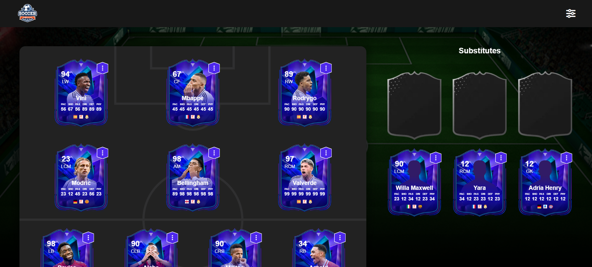

# Gestion d'Équipe Ultime

Une application web pour gérer des équipes de football, conçue pour simplifier l'organisation des joueurs, changer les formations et conserver les données grâce au stockage local.

## Table des Matières

- [Fonctionnalités](#fonctionnalités)
- [Technologies Utilisées](#technologies-utilisées)
- [Installation](#installation)
- [Utilisation](#utilisation)
- [Captures d'Écran](#captures-décran)
- [Contributions](#contributions)
- [Licence](#licence)
- [Remerciements](#remerciements)

## Fonctionnalités

- **Glisser-Déposer** : Organisez facilement les joueurs en les glissant dans les positions sur le terrain.
- **Changement de Formation** : Changez rapidement entre différentes formations (par exemple, 4-3-3, 4-4-2, 3-4-3) à l'aide d'un menu déroulant convivial.
- **Gestion des Substitutions Intelligente** : Déplacez automatiquement les joueurs vers la liste des remplaçants si leur position désignée est déjà occupée, évitant ainsi les conflits.
- **Persistance des Données** : Utilisez le stockage local pour enregistrer les données de l'équipe, garantissant que les informations restent intactes même après un rafraîchissement de la page.
- **Interface Conviviale** : Un design propre et intuitif qui améliore l'expérience utilisateur tant pour les novices que pour les utilisateurs expérimentés.

## Technologies Utilisées

- **HTML** : Pour structurer l'application web.
- **CSS** : Pour le style et la mise en page afin d'améliorer l'attrait visuel.
- **JavaScript** : Pour l'interactivité et la gestion de la fonctionnalité de glisser-déposer, ainsi que la manipulation des données.

## Installation

Pour configurer le projet localement, suivez ces étapes :

1. **Clonez le dépôt** :
   ```bash
   git clone https://github.com/aliyara290/ultimate-team.git
   ```
2. **Naviguez dans le répertoire du projet** :
   ```bash
   cd ultimate-team
   ```
3. **Ouvrez `index.html` dans votre navigateur web** pour voir l'application.

## Utilisation

1. **Ajoutez des Joueurs** : Entrez les détails des joueurs dans les champs de saisie fournis et ajoutez-les à l'équipe.
2. **Organisez les Joueurs** : Glissez et déposez les joueurs dans leurs positions respectives sur le terrain.
3. **Changez la Formation** : Utilisez le menu déroulant pour changer les formations selon vos besoins.
4. **Gestion du Rafraîchissement** : Testez l'application en rafraîchissant la page pour voir que vos modifications sont préservées grâce au stockage local.

## Captures d'Écran

  
*Exemple de l'interface de gestion d'équipe.*

## Contributions

Les contributions sont les bienvenues ! Si vous souhaitez contribuer, veuillez suivre ces étapes :

1. Forkez le dépôt.
2. Créez une nouvelle branche (`git checkout -b feature/VotreFonctionnalité`).
3. Engagez vos modifications (`git commit -m 'Ajoutez une fonctionnalité'`).
4. Poussez vers la branche (`git push origin feature/VotreFonctionnalité`).
5. Ouvrez une demande de tirage.

Veuillez vous assurer que votre code respecte les directives de style du projet et qu'il est soigneusement testé.

## Licence

Ce projet est sous licence MIT. Consultez le fichier [LICENSE](LICENSE) pour plus de détails.

## Remerciements

- Merci à la communauté open-source pour son soutien continu et ses ressources.
- Un grand merci à tous ceux qui ont contribué au projet, fourni des commentaires ou inspiré son développement.
